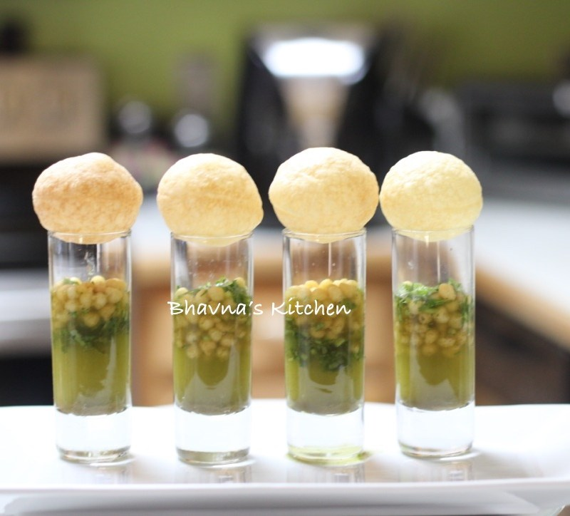

# assignment2-Banda
# Rasagna Reddy Banda
###### Panipuri
Panipuri is a **Indian snack**, it consists of a round or ball-shaped, hollow puri (a deep-fried crisp flatbread), filled with a mixture of **flavored water, tamarind chutney, chili powder, chaat masala, potato mash, onion or chickpeas**. It is my favourate food because it consists of all **falvours**.



---
# Job

Quality analyst
1. The Quality Analyst is responsible for developing and supporting the planning, design, and execution of test plans, test scripts, and process plans for projects.
2. To be successful as a Quality Analyst, you should demonstrate strong attention to detail and have analytical and problem-solving abilities.


- Quality analysts responsibities includes working with developers closely and getting the errors resolved by them
- A Quality analyst must create test scripts according to the website with the errors identified

[About Me](AboutMe.md)

---
# Table of favourite location

I am sharing my favourite places which I would recomend to visit.
| Location | Time | Expenditure |
| :---: | :---: | :---: |
| Goa | 8 | 300$ |
| Kerala | 6 | 400$ |
| Agra | 5 | 200$ |
| Kashmir | 8 | 700$ |


---

# Best Quotes

 > "The purpose of our lives is to be happy." - *Dalai Lama*

 > "Not how long, but how well you have lived is the main thing." - *Seneca*

---
# Code fencing

Lingo - Lingo is a verbose object-oriented (OO) scripting language developed by John H. Thompson for use in Adobe Director (formerly Macromedia Director). Lingo is used to develop desktop application software, interactive kiosks, CD-ROMs and Adobe Shockwave content.
Source link <https://en.wikipedia.org/wiki/Lingo_(programming_language)>

```
X = 1.5 * Y + Z / 2 * Y; !This is a comment;

X = 1.5 * !This is a comment in the middle

of a constraint; Y + Z / 2 * Y;

```
Code Source <https://www.lindo.com/doc/online_help/lingo15_0/developing_a_lingo_model.htm>